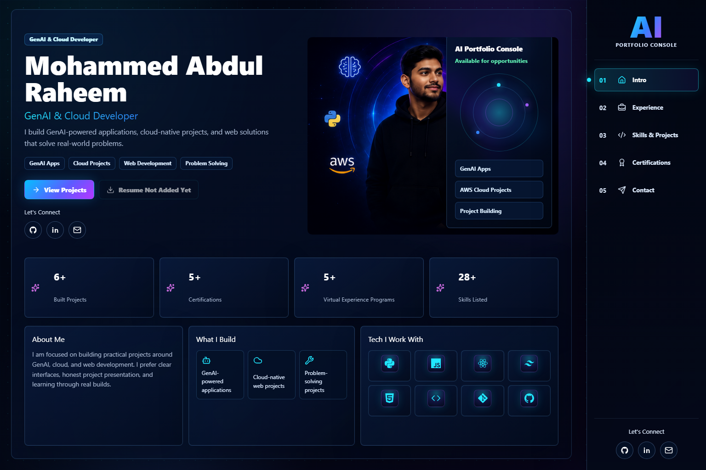
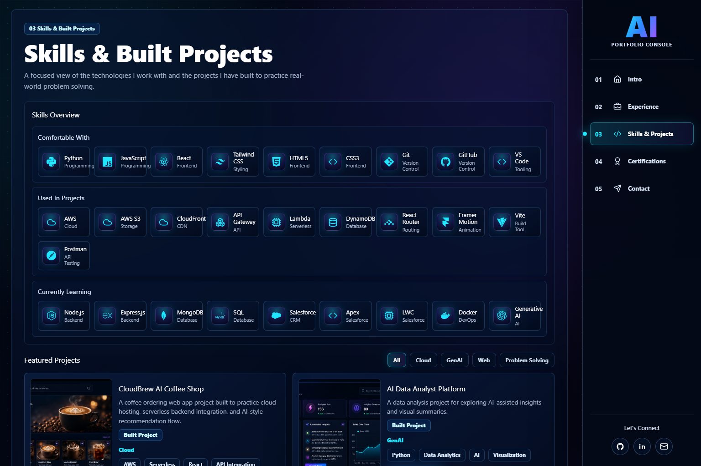
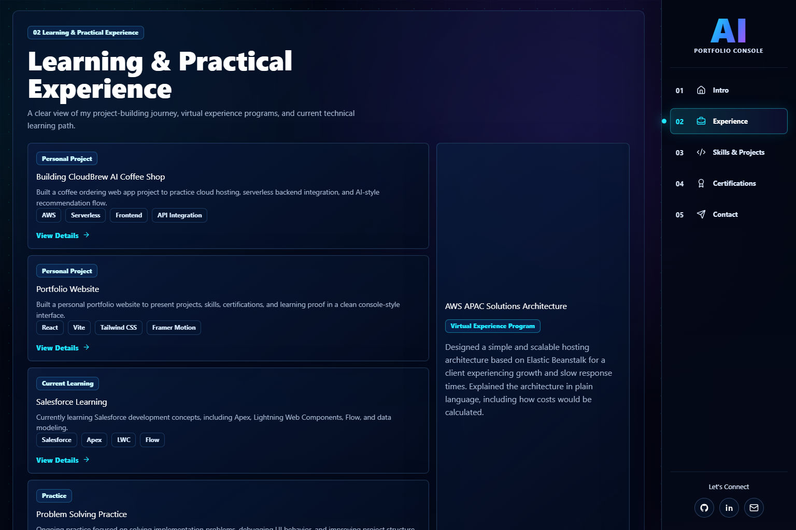
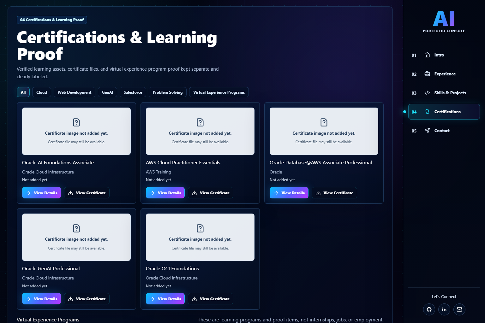
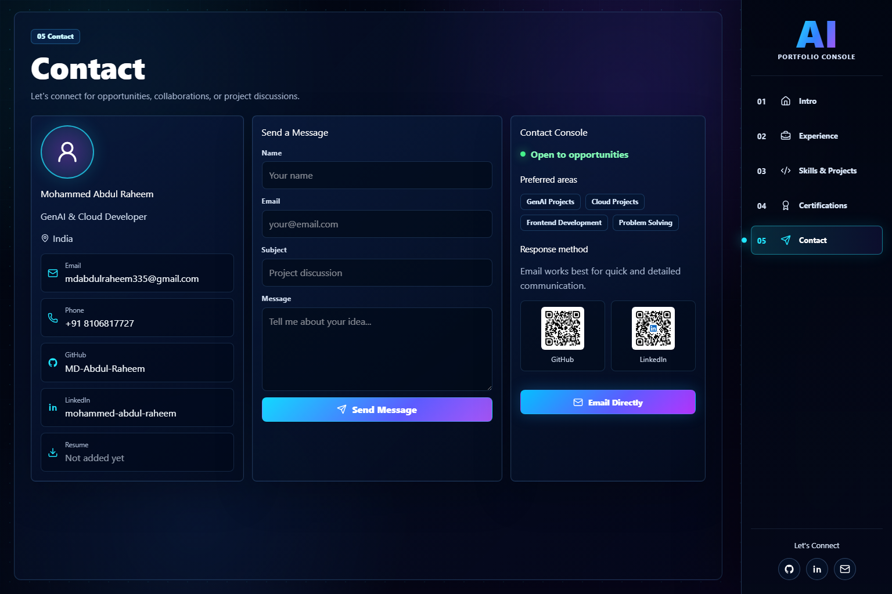

# Mohammed Abdul Raheem - AI Portfolio Console


A dark futuristic portfolio website for **Mohammed Abdul Raheem**, built as an AI Portfolio Console for recruiters, hiring managers, and technical reviewers.

The portfolio presents my Salesforce learning journey, GenAI and cloud projects, certifications, virtual experience programs, technical skills, resume, and contact information in a responsive, production-ready React application.

## Portfolio Overview

This website is designed to be honest, recruiter-friendly, and easy to navigate. It separates current learning, personal projects, certifications, and Virtual Experience Programs so each item is represented accurately.

## Features

- Premium dark AI console interface with neon cyan, blue, and purple accents.
- Route-based portfolio pages for Intro, Experience, Skills & Projects, Certifications, and Contact.
- Project detail pages with overview, features, tech stack, use cases, GitHub links, and learning notes.
- Certification detail pages with certificate previews, downloads, learning outcomes, and credential status.
- Experience page focused on present Accenture journey and completed Virtual Experience Programs.
- Dedicated detail pages for experience and programs.
- Downloadable resume.
- Responsive design for desktop, tablet, and mobile.
- Accessible links, buttons, focus states, and readable contrast.
- Vercel-ready SPA routing through `vercel.json`.

## Tech Stack

- **Frontend:** React, Vite
- **Styling:** Tailwind CSS, custom CSS
- **Routing:** React Router
- **Animation:** Framer Motion
- **Icons:** Lucide React, React Icons
- **Deployment:** Vercel
- **Version Control:** Git, GitHub

## Screenshots

| Home | Skills & Projects |
| --- | --- |
|  |  |

| Experience | Certifications |
| --- | --- |
|  |  |

| Contact |
| --- |
|  |

## Project Structure

```text
.
├── docs/
│   └── screenshots/
├── public/
│   ├── assets/
│   │   ├── badges/
│   │   ├── certificate-previews/
│   │   ├── certificates/
│   │   ├── cursor/
│   │   ├── logo/
│   │   ├── logos/
│   │   ├── profile/
│   │   ├── projects/
│   │   ├── qr/
│   │   └── resume/
│   └── favicon.svg
├── src/
│   ├── components/
│   ├── data/
│   ├── layouts/
│   ├── pages/
│   ├── utils/
│   ├── App.jsx
│   ├── index.css
│   └── main.jsx
├── index.html
├── package.json
├── vite.config.js
└── vercel.json
```

## Installation

```bash
git clone https://github.com/MD-Abdul-Raheem/My-Portfolio.git
cd My-Portfolio
npm install
```

## Local Development

```bash
npm run dev
```

Open the local URL shown by Vite, usually:

```text
http://localhost:5173
```

## Build

```bash
npm run build
```

## Preview Production Build

```bash
npm run preview
```

## Deployment

This project is configured for Vercel.

Recommended Vercel settings:

- **Framework Preset:** Vite
- **Build Command:** `npm run build`
- **Output Directory:** `dist`
- **Install Command:** `npm install`

The `vercel.json` file includes a rewrite so React Router deep links work correctly in production.

## Contact

- **Email:** [mdabdulraheem335@gmail.com](mailto:mdabdulraheem335@gmail.com)
- **GitHub:** [MD-Abdul-Raheem](https://github.com/MD-Abdul-Raheem)
- **LinkedIn:** [mohammed-abdul-raheem-9868412b2](https://www.linkedin.com/in/mohammed-abdul-raheem-9868412b2)
- **Instagram:** [_md_abdul_raheem_](https://www.instagram.com/_md_abdul_raheem_)
- **WhatsApp:** [Connect on WhatsApp](https://wa.me/qr/I5GXDOOA4DPFC1)

## Future Roadmap

- Add final production deployment URL after Vercel deployment.
- Add more detailed Salesforce project documentation as confirmed work becomes available.
- Add additional project screenshots and architecture notes.
- Add optional contact form backend when an email service is configured.
- Continue improving accessibility and performance based on recruiter feedback.

## License

This project is licensed under the [MIT License](LICENSE).
